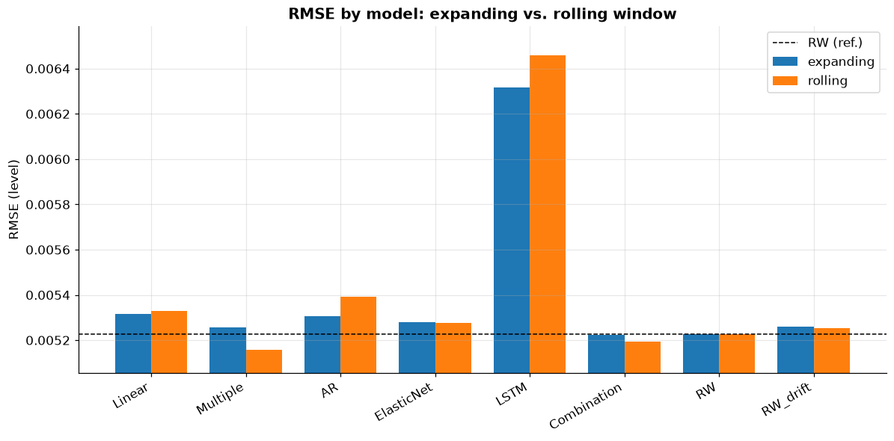
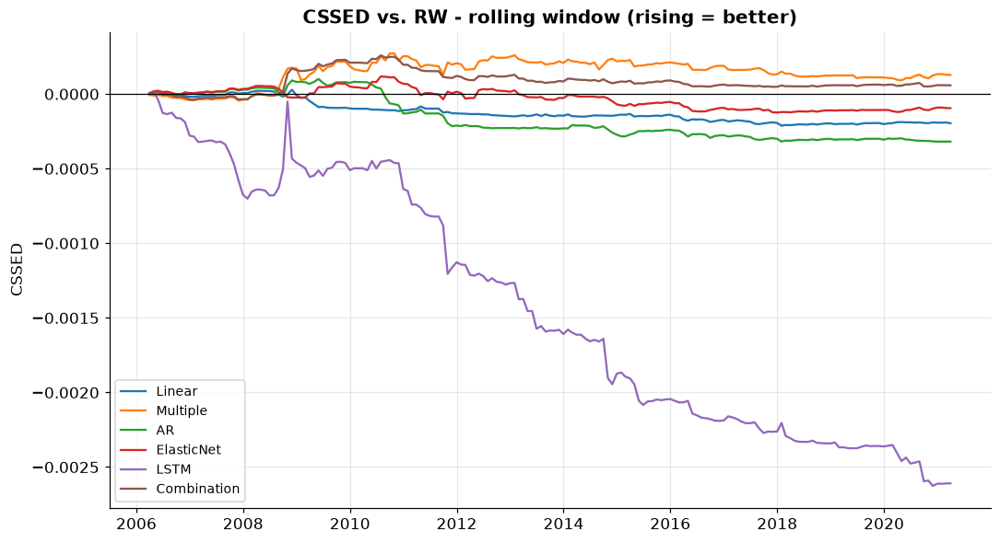
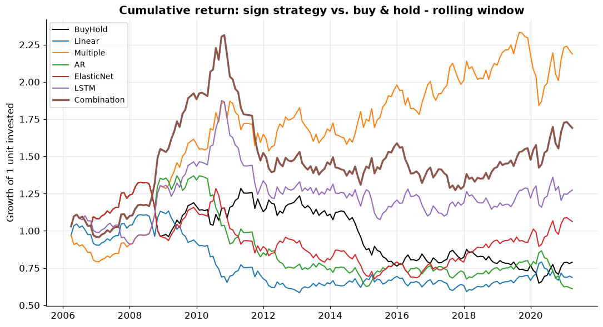

# Forecasting NOK/USD from the oil-futures term structure


A quantitative project that investigates whether the information in the **term
structure** (the forward curve) of **ICE Brent** crude oil can forecast the
Norwegian krone against the US dollar. Norway is a large oil exporter and the
krone is often described as a *petrocurrency* — so it is an economic hypothesis
worth testing empirically.

> **Status:** Portfolio project. The code is modular so each analysis step can be
> run on its own.

---

## 1. Motivation and hypothesis

The oil price affects Norway's terms of trade and therefore the demand for kroner.
But the *level* of the oil price is only one piece. The **shape** of the forward
curve carries forward-looking information:

- **Contango** (upward curve) vs. **backwardation** (downward) says something
  about the market's expectations of supply/demand and storage costs.
- Changes in the curve's *level*, *slope* and *curvature* may lead currency moves.

We compress the whole curve into three interpretable factors with the
**Diebold–Li** method (level, slope, curvature) and test whether they forecast
NOK/USD better than a naive random walk.

---

## 2. Data

| File | Content | Frequency | Period |
|------|---------|-----------|--------|
| `NOKUSD.xlsx` | US$ per Norwegian krone (Datastream/Refinitiv `RFV`) | Monthly | 2001-01 – 2021-03 |
| `OilFuturesPrices.xlsx` | ICE Brent settlement, `TRc1`–`TRc12` (nearby 1–12) | Monthly | 2001-01 – 2021-03 |

After alignment: **243 complete monthly observations**, no missing values. `M1`
(front-month) is the "first nearby".

**FX orientation:** `NOKUSD` = *USD per krone* (~0.11), i.e. the price of the
krone in dollars. We therefore expect **positive** co-movement with oil: higher
oil price → stronger krone → higher `NOKUSD`.

#### Why this data source is good

The project needs a *historical* 1–12 month nearby curve to estimate the
Diebold–Li factors over time. While setting up, I mapped the free online sources
carefully — a lesson worth noting:

- **yfinance** gives the front-month and only *live* dated contracts — expired
  ones are deleted, so a historical 1–12 curve cannot be reconstructed.
- **EIA** has real history, but only WTI nearby 1–4 (Brent spot only).
- **Nasdaq Data Link / CHRIS** (`ICE_B1`–`B12`) has been discontinued.
- **Oil Price API / Databento** have real Brent curves, but history sits behind
  payment / trial credits.

So the clean, complete **ICE Brent 1–12 curve** comes from a local
**Datastream/Refinitiv extract** (the `.xlsx` files). The source is nonetheless
**modular** (`src/data_loader.py`): a new `TermStructureLoader` subclass for a
Bloomberg/Refinitiv API can be plugged in without changing the rest of the code.

> **License:** Datastream data is licensed and is therefore *not* committed to the
> repo (`data/` is git-ignored). Place your own `NOKUSD.xlsx` and
> `OilFuturesPrices.xlsx` in `data/` to run the project.

#### Expected Excel format

The code is flexible but expects two files in `data/`. In both, the **first
column is dates** (the header can be anything — in the Datastream extract it is
`Name`), and each row is one observation (here month-end).

**`OilFuturesPrices.xlsx`** — one sheet, one column per maturity. Each price
column header must contain `TRc<n>`, where `<n>` is the nearby number 1–12. The
loader reads the number out of the header and names the columns `M1`…`M12`, so
the order in the file does not matter.

| Name | ICE-BRENT CRUDE OIL TRc1 - SETT. PRICE | … | ICE-BRENT CRUDE OIL TRc12 - SETT. PRICE |
|------|---------------------------------------:|---|----------------------------------------:|
| 2001-01-31 | 26.66 | … | 23.35 |
| 2001-02-28 | 25.57 | … | 23.61 |

**`NOKUSD.xlsx`** — one sheet, **exactly one** value column (the header is
irrelevant). Values are read as *USD per krone* (NOKUSD ≈ 0.11).

| Name | US $ TO NORWEGIAN KRONE (RFV) - EXCHANGE RATE |
|------|----------------------------------------------:|
| 2001-01-31 | 0.114055 |
| 2001-02-28 | 0.112199 |

To use a different crude (e.g. WTI) or a different FX orientation, just swap the
files as long as they follow the format above — or write a new loader in
`src/data_loader.py` for a completely different source format (an API, etc.).

---

## 3. Method (brief, with learning notes)

1. **Data acquisition & alignment** — common monthly date index, no leakage.
   (`src/data_acquisition.py`)
2. **Exploratory analysis** — NOK/USD vs. front-month, 60-month rolling
   correlation, 3D plot of the term structure (time × maturity × price).
3. **Diebold–Li factors** — level (β₁), slope (β₂), curvature (β₃) from the
   curve, with a justified choice of the decay parameter λ.
4. **Forecasting (rolling, out-of-sample)** — the factors are used as predictors
   in: simple linear regression, multiple regression, an AR model, a regularised
   method (Elastic Net), a **PyTorch LSTM**, and a **model combination**. Run
   under **two windowing schemes** (see below).
5. **Evaluation** — true vs. predicted, RMSE table vs. random walk (with/without
   drift), CSSED curves, and the **Diebold–Mariano** test (p-values).
6. **Profitability** — a simple sign-based trading strategy, cumulative return.

### Two out-of-sample windowing schemes

The forecasts are produced under both standard schemes (window = 60 months,
identical out-of-sample period, so they are directly comparable):

- **Expanding (recursive):** train on all data up to *t*; the window grows.
- **Rolling (fixed):** train only on the most recent 60 months; the window slides.

The rolling window adapts to a *time-varying* oil–FX relationship (which the
exploratory analysis shows is real), at the cost of a smaller training sample.

Key concepts are explained where they are used (docstrings/markdown), e.g.:
- the *Diebold–Li factors* as an interpretable 3-dimensional compression of the curve;
- *Diebold–Mariano* to test whether two models' forecast errors differ significantly;
- the *rolling out-of-sample window* to mimic real-time forecasting without leakage.

---

## 4. Project structure

```
currency_forecasting/
├── data/            # Excel sources + cleaned dataset (git-ignored)
├── src/
│   ├── config.py            # paths + parameters
│   ├── data_loader.py       # modular data-source interface (Excel/yfinance/EIA)
│   ├── data_acquisition.py  # step 1: read & align
│   ├── eda.py               # step 2: exploratory analysis
│   ├── diebold_li.py        # step 3: level/slope/curvature
│   ├── forecasting.py       # step 4: rolling OOS forecasts (+ LSTM, 2 schemes)
│   ├── evaluation.py        # step 5: RMSE, CSSED, Diebold-Mariano
│   ├── trading.py           # step 6: sign strategy & profitability
│   └── utils.py             # figure style & saving
├── notebooks/
│   └── analysis.ipynb       # narrative walkthrough that calls the src modules
├── output/          # figures & tables (git-ignored; a selection in README_examples/)
├── tests/           # smoke tests
├── main.py          # run the whole pipeline (steps 1-6)
└── requirements.txt
```

---

## 5. How to run

```bash
python -m venv .venv
.venv\Scripts\activate            # Windows
pip install -r requirements.txt

# Place NOKUSD.xlsx and OilFuturesPrices.xlsx in data/

# Easiest: run the whole analysis (steps 1-6) from one place
python main.py
# (or jump in from a given step, e.g. step 4:  python main.py 4)

# Or run the steps individually:
python -m src.data_acquisition    # step 1
python -m src.eda                 # step 2
python -m src.diebold_li          # step 3
python -m src.forecasting         # step 4: both windowing schemes (~1 min)
python -m src.evaluation          # step 5
python -m src.trading             # step 6

# Or run the whole narrative in the notebook:
jupyter notebook notebooks/analysis.ipynb
```

---

## 6. Results

*All figures are generated to `output/` when the steps run. A selection lives in
`output/README_examples/` and is shown below.*

### 6.1 Do the krone and oil move together?

Yes. NOK/USD and Brent front-month co-move clearly (the 2008 peak, the 2014
collapse, the 2020 COVID crash). The correlation on monthly returns is **0.53**,
but the **60-month rolling correlation ranges from 0.06 to 0.72** — the link is
real but not constant. This time variation is exactly why the rolling window
helps later.


### 6.2 The term structure and the Diebold-Li factors

Nelson-Siegel fits the Brent curve almost perfectly (fit RMSE ≈ 0.09 USD/bbl at
the chosen λ = 0.23). The factors are economically interpretable: **Level** tracks
the oil price (corr. 0.95 with front-month), **Slope** turns sharply negative
during the contango episodes of 2008–09 and 2014–15, and **Curvature** captures
the mid-curve hump.


### 6.3 Forecasting: do the factors beat a random walk?

Barely — and that is an honest, instructive finding (cf. Meese–Rogoff: currencies
are very hard to beat with a random walk). Level RMSE, out-of-sample 2006–2021,
for both windowing schemes:

| Model | RMSE (expanding) | RMSE (rolling) | vs RW |
|-------|-----------------:|---------------:|:-----:|
| **Combination** | 0.005224 | **0.005195** | best under rolling |
| Random walk | 0.005226 | 0.005226 | benchmark |
| Multiple | 0.005255 | **0.005158** | beats RW under rolling |
| ElasticNet | 0.005279 | 0.005276 | ≈ RW |
| AR(1) | 0.005306 | 0.005392 | worse |
| Linear | 0.005315 | 0.005329 | worse |
| LSTM | 0.006318 | 0.006460 | clearly worse |



No model beats RW *significantly* (Diebold–Mariano). But the **rolling** window
nudges `Multiple` and `Combination` just below RW, while the LSTM is
significantly **worse** under both schemes (DM p ≈ 0.003). CSSED confirms this
over time:



### 6.4 Profitability: direction beats level

An important point: low RMSE and a profitable *direction* are not the same. A
simple sign strategy (long/short the krone on the predicted sign) gives — and the
**rolling window improves almost everything**, consistent with the time-varying
oil–FX link:

| Strategy | Total (exp.) | Sharpe (exp.) | Total (roll.) | Sharpe (roll.) | Hit (roll.) |
|----------|-------------:|--------------:|--------------:|---------------:|:-----------:|
| **Multiple** | +105 % | 0.46 | **+119 %** | **0.50** | 57 % |
| Combination | +29 % | 0.20 | +69 % | 0.35 | 56 % |
| LSTM | −0.4 % | 0.06 | +27 % | 0.19 | 53 % |
| Buy & hold (NOK) | −21 % | −0.07 | −21 % | −0.07 | – |



> **Interpretation:** The term-structure factors carry a weak but economically
> meaningful *directional* signal for the krone. They do not beat a random walk on
> pure forecast accuracy — in line with the literature — but can still be valuable
> in a directional strategy, especially with an adaptive (rolling) window.
> Results are reported deliberately without overstatement.

---

## 7. Limitations

- **Monthly** frequency, 243 observations (2001–2021). Solid for Diebold–Li (the
  same setup as the original paper), but it limits how complex an AI model can be
  trained without overfitting — handled with a small architecture and strict
  out-of-sample validation.
- Currency forecasting is notoriously hard; results are interpreted accordingly.

---

## 8. Tech stack

Python · pandas · numpy · statsmodels · scikit-learn · matplotlib · PyTorch ·
openpyxl · (yfinance/EIA as alternative sources)

---

## 9. License

The code is licensed under **MIT** — see [LICENSE](LICENSE). You are free to use,
modify and share it.

> **Note:** the license covers only the *code* in this repo. The market data
> (Datastream/Refinitiv) is licensed third-party data and is **not** included or
> covered by the MIT license — see the data-source note in section 2.
