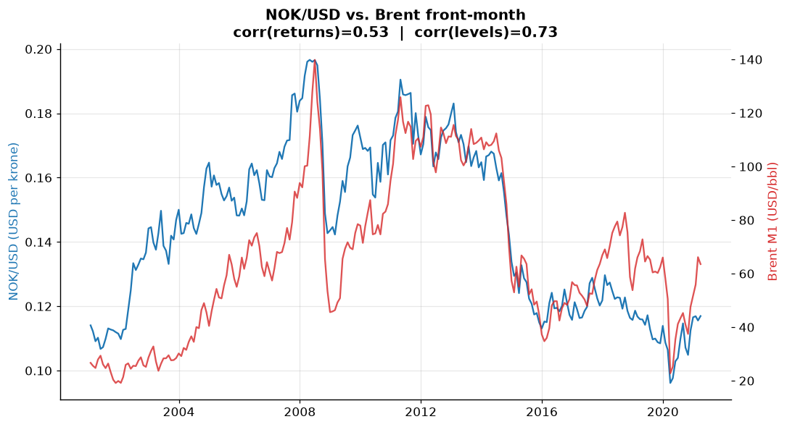
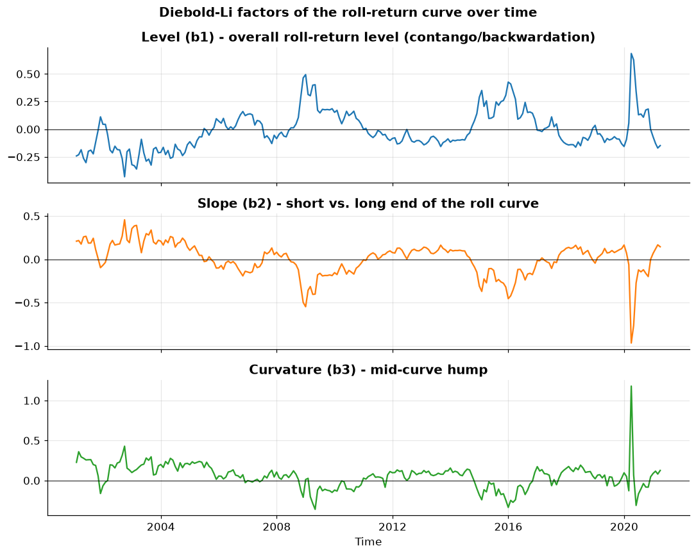
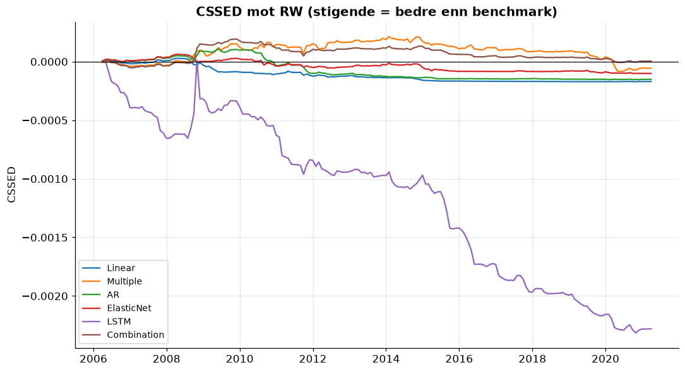
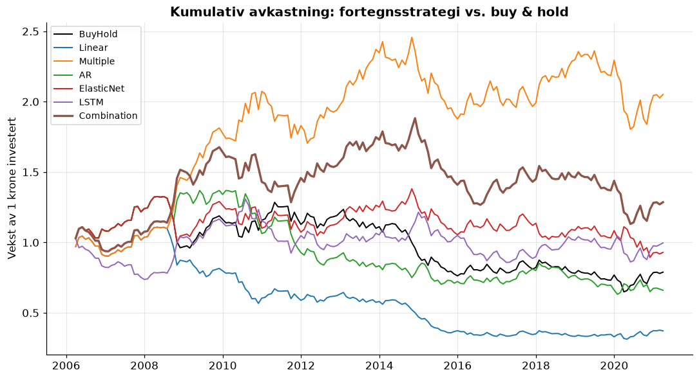

# Prognose av NOK/USD fra oljefuturesenes terminstruktur


Et kvantitativt prosjekt som undersøker om informasjonen i **terminstrukturen**
(forward-kurven) til **ICE Brent**-råolje kan forutsi den norske kronen mot
dollar. Norge er en stor oljeeksportør, og kronen omtales ofte som en
*petrovaluta* – derfor er det en økonomisk hypotese verdt å teste empirisk.

> **Status:** Pågående porteføljeprosjekt. Koden er modulær slik at hvert
> analysesteg kan kjøres for seg.

---

## 1. Motivasjon og hypotese

Oljeprisen påvirker Norges bytteforhold (terms of trade) og dermed etterspørselen
etter kroner. Men *nivået* på oljeprisen er bare én bit. Selve **formen** på
forward-kurven inneholder framoverskuende informasjon:

- **Contango** (oppadgående kurve) vs. **backwardation** (nedadgående) sier noe
  om markedets forventninger til tilbud/etterspørsel og lagerkostnader.
- Endringer i kurvens *nivå*, *helning* og *krumning* kan lede valutabevegelser.

Vi komprimerer hele kurven til tre tolkbare faktorer med **Diebold–Li**-metoden
(nivå, helning, krumning) og tester om disse predikerer NOK/USD bedre enn en
naiv *random walk*.

---

## 2. Data

| Serie | Innhold | Frekvens | Periode |
|-------|---------|----------|---------|
| `NOKUSD.xlsx` | US$ per norsk krone (Datastream/Refinitiv `RFV`) | Månedlig | 2001-01 – 2021-03 |
| `OilFuturesPrices.xlsx` | ICE Brent settlement, `TRc1`–`TRc12` (nearby 1–12) | Månedlig | 2001-01 – 2021-03 |

Resultat etter align: **243 komplette månedlige observasjoner**, ingen manglende
verdier. `M1` (front-month) brukes som "first nearby".

**FX-orientering:** `NOKUSD` = *USD per krone* (~0,11). Altså prisen på kronen
målt i dollar. Da forventer vi **positiv** samvariasjon med olje: høyere oljepris
→ sterkere krone → høyere `NOKUSD`.

#### Om datakilden og hvorfor den er god

Prosjektet trenger en *historisk* 1–12 måneders nearby-kurve for å estimere
Diebold–Li-faktorene over tid. Under oppsettet kartla jeg gratis nettkilder
grundig, og det er en lærdom verdt å nevne:

- **yfinance** gir front-month og kun *levende* daterte kontrakter – utløpte
  slettes, så en historisk 1–12-kurve kan ikke rekonstrueres.
- **EIA** har ekte historikk, men kun WTI nearby 1–4 (Brent bare spot).
- **Nasdaq Data Link / CHRIS** (`ICE_B1`–`B12`) er avviklet.
- **Oil Price API / Databento** har ekte Brent-kurver, men historikk ligger bak
  betaling / prøvekreditt.

Den rene, komplette **ICE Brent 1–12-kurven** kommer derfor fra et lokalt
**Datastream/Refinitiv-uttrekk** (`.xlsx`-filene). Datakilden er likevel gjort
**modulær** (`src/data_loader.py`): en ny `TermStructureLoader`-subklasse for et
Bloomberg/Refinitiv-API kan plugges inn uten å endre resten av koden.

> **Lisens:** Datastream-data er lisensiert og sjekkes derfor *ikke* inn i repoet
> (`data/` er git-ignorert). Legg dine egne `NOKUSD.xlsx` og
> `OilFuturesPrices.xlsx` i `data/` for å kjøre prosjektet.

#### Forventet Excel-format

Koden er fleksibel, men forventer to filer i `data/`. I begge er **første kolonne
datoer** (kolonneoverskriften kan hete hva som helst – i Datastream-uttrekket
heter den `Name`), og hver rad er én observasjon (her månedsslutt).

**`OilFuturesPrices.xlsx`** – ett ark, én kolonne per maturity. Hver
pris-kolonne må ha en overskrift som inneholder `TRc<n>`, der `<n>` er
nearby-nummeret 1–12. Lasteren leser tallet ut av overskriften og navngir
kolonnene `M1`…`M12`, så rekkefølgen i fila spiller ingen rolle.

| Name | ICE-BRENT CRUDE OIL TRc1 - SETT. PRICE | … | ICE-BRENT CRUDE OIL TRc12 - SETT. PRICE |
|------|---------------------------------------:|---|----------------------------------------:|
| 2001-01-31 | 26.66 | … | 23.35 |
| 2001-02-28 | 25.57 | … | 23.61 |

**`NOKUSD.xlsx`** – ett ark, **nøyaktig én** verdikolonne (overskriften er
likegyldig). Verdiene tolkes som *USD per krone* (NOKUSD ≈ 0,11).

| Name | US $ TO NORWEGIAN KRONE (RFV) - EXCHANGE RATE |
|------|----------------------------------------------:|
| 2001-01-31 | 0.114055 |
| 2001-02-28 | 0.112199 |

Vil du bruke en annen olje (f.eks. WTI) eller en annen FX-orientering, holder det
å bytte ut filene så lenge de følger formatet over – eller å skrive en ny loader
i `src/data_loader.py` for et helt annet kildeformat (API e.l.).

---

## 3. Metode (kort, med læringsnoter)

1. **Datainnhenting & align** – felles månedlig datoindeks, ingen lekkasje.
   (`src/data_acquisition.py`)
2. **Eksplorativ analyse** – NOK/USD vs. front-month, 60-måneders rullende
   korrelasjon, 3D-plott av terminstrukturen (tid × maturity × pris).
3. **Diebold–Li-faktorer** – nivå (β₁), helning (β₂), krumning (β₃) fra
   kurven, med begrunnet valg av henfallsparameteren λ.
4. **Prognose (rullende, out-of-sample)** – faktorene brukes som prediktorer i:
   enkel lineær regresjon, multippel regresjon, AR-modell, en regularisert
   metode (begrunnes), en **PyTorch LSTM/MLP**, og en **modellkombinasjon**.
5. **Evaluering** – sann vs. predikert, RMSE-tabell mot random walk (med/uten
   drift), CSSED-kurver, og **Diebold–Mariano**-test (p-verdier).
6. **Lønnsomhet** – enkel fortegnsbasert handelsstrategi, kumulativ avkastning.

Sentrale begreper forklares der de brukes (docstrings/markdown), f.eks.:
- *Diebold–Li-faktorene* som tolkbar tre-dimensjons sammenpressing av kurven.
- *Diebold–Mariano* for å teste om to modellers prognosefeil er signifikant ulike.
- *Rullende out-of-sample-vindu* for å etterligne sanntidsprognoser uten lekkasje.

---

## 4. Mappestruktur

```
currency_forecasting/
├── data/            # Excel-kilder + renset datasett (git-ignorert)
├── src/
│   ├── config.py            # stier + parametre
│   ├── data_loader.py       # modulært datakilde-grensesnitt (Excel/yfinance/EIA)
│   ├── data_acquisition.py  # steg 1: les & align
│   ├── eda.py               # steg 2: eksplorativ analyse
│   ├── diebold_li.py        # steg 3: nivå/helning/krumning
│   ├── forecasting.py       # steg 4: rullende OOS-prognoser (+ LSTM)
│   ├── evaluation.py        # steg 5: RMSE, CSSED, Diebold-Mariano
│   ├── trading.py           # steg 6: fortegnsstrategi & lønnsomhet
│   └── utils.py             # figurstil & lagring
├── notebooks/
│   └── analysis.ipynb       # narrativ gjennomgang som kaller src-modulene
├── output/          # figurer & tabeller (git-ignorert; utvalg i README_examples/)
├── tests/           # røyktester
└── requirements.txt
```

---

## 5. Slik kjører du prosjektet

```bash
python -m venv .venv
.venv\Scripts\activate            # Windows
pip install -r requirements.txt

# Legg NOKUSD.xlsx og OilFuturesPrices.xlsx i data/
python -m src.data_acquisition    # steg 1: les, align & lagre data
python -m src.eda                 # steg 2: eksplorativ analyse
python -m src.diebold_li          # steg 3: Diebold-Li-faktorer
python -m src.forecasting         # steg 4: rullende OOS-prognoser (~30 s)
python -m src.evaluation          # steg 5: RMSE / CSSED / Diebold-Mariano
python -m src.trading             # steg 6: lønnsomhet

# eller kjør hele narrativet i notebooken:
jupyter notebook notebooks/analysis.ipynb
```

---

## 6. Resultater

*Alle figurer genereres til `output/` når stegene kjøres. Et utvalg ligger i
`output/README_examples/` og vises under.*

### 6.1 Henger kronen og oljen sammen?

Ja. NOK/USD og Brent front-month samvarierer tydelig (2008-toppen,
2014-kollapsen, 2020-COVID). Korrelasjon på månedlig avkastning er **0,53**, men
den **60-måneders rullende korrelasjonen varierer fra 0,06 til 0,72** – koblingen
er reell, men ikke konstant.



### 6.2 Terminstrukturen og Diebold-Li-faktorene

Nelson-Siegel treffer Brent-kurven nesten perfekt (tilpasnings-RMSE ≈ 0,09
USD/fat ved valgt λ = 0,23). Faktorene er økonomisk tolkbare: **Nivå** sporer
oljeprisen (korr. 0,95 med front-month), **Helning** blir kraftig negativ under
contango-periodene 2008–09 og 2014–15, og **Krumning** fanger pukkelen på midten.



### 6.3 Prognoser: er faktorene bedre enn en random walk?

Knapt – og det er et ærlig, lærerikt funn (jf. Meese–Rogoff: valuta er svært
vanskelig å slå med en random walk). RMSE på nivå, out-of-sample 2006–2021:

| Modell | RMSE | Rel. RW | DM vs RW (p) |
|--------|-----:|--------:|:-----------:|
| **Combination** | **0,005224** | **0,9996** | 0,98 (≈ RW) |
| Random walk | 0,005226 | 1,000 | – |
| Multiple | 0,005255 | 1,006 | 0,80 |
| RW + drift | 0,005260 | 1,006 | – |
| ElasticNet | 0,005279 | 1,010 | 0,28 |
| AR(1) | 0,005306 | 1,015 | 0,20 |
| Linear | 0,005315 | 1,017 | 0,03 *(verre)* |
| LSTM | 0,006318 | 1,209 | 0,003 *(verre)* |

Kombinasjonen så vidt foran RW, men ingen modell slår RW *signifikant*; LSTM og
enkel lineær er signifikant **dårligere**. CSSED bekrefter dette over tid:



### 6.4 Lønnsomhet: retning slår nivå

Et viktig poeng: lav RMSE og lønnsom *retning* er ikke det samme. En enkel
fortegnsstrategi (long/short kronen ut fra predikert fortegn) gir:

| Strategi | Totalavk. | Sharpe | Treffrate |
|----------|----------:|-------:|:---------:|
| **Multiple** | **+105 %** | **0,46** | 54 % |
| Combination | +29 % | 0,20 | 52 % |
| LSTM | −0,4 % | 0,06 | 50 % |
| Buy & hold (NOK) | −21 % | −0,07 | – |
| Linear | −63 % | −0,49 | 49 % |

Multippel-regresjonens 54 % retningstreff ga klart bedre avkastning enn buy &
hold, selv om RMSE-gevinsten mot RW var marginal.



> **Tolkning:** Terminstruktur-faktorene bærer en svak, men økonomisk meningsfull
> retningssignal for kronen. De slår ikke random walk på ren prognosepresisjon –
> i tråd med litteraturen – men kan likevel være verdifulle i en
> retningsbasert strategi. Resultatene er bevisst rapportert uten
> overdrivelse.

---

## 7. Begrensninger

- **Månedlig** frekvens, 243 observasjoner (2001–2021). Solid for Diebold–Li
  (samme oppsett som originalartikkelen), men begrenser hvor komplekse
  AI-modeller som kan trenes uten overtilpasning – håndteres med enkel
  arkitektur og streng out-of-sample-validering.
- Valutaprognoser er notorisk vanskelige; resultatene tolkes deretter.

---

## 8. Teknologi

Python · pandas · numpy · statsmodels · scikit-learn · matplotlib · PyTorch ·
openpyxl · (yfinance/EIA som alternative kilder)

---

## 9. Lisens

Koden er lisensiert under **MIT** – se [LICENSE](LICENSE). Du står fritt til å
bruke, endre og dele den.

> **Merk:** Lisensen dekker kun *koden* i dette repoet. Markedsdataene
> (Datastream/Refinitiv) er lisensiert tredjepartsdata og er **ikke** inkludert
> eller dekket av MIT-lisensen – se datakilde-merknaden i avsnitt 2.
