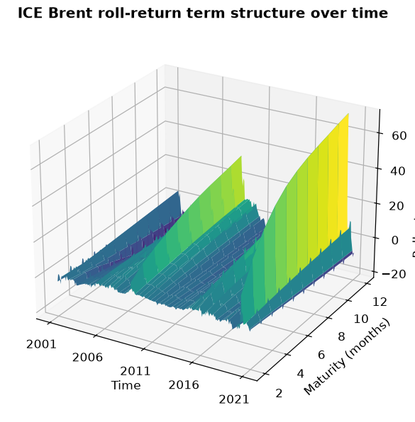

# Forecasting NOK/USD from the oil-futures term structure


A quantitative project that investigates whether the information in the **term
structure** (the forward curve) of **ICE Brent** crude oil can forecast the
Norwegian krone against the US dollar. Norway is a large oil exporter and the
krone is often described as a *petrocurrency* — so it is an economic hypothesis
worth testing empirically.

> **Status:** Portfolio project. The code is modular so each analysis step can be
> run on its own.

---

## 1. Motivation and hypothesis

The oil price affects Norway's terms of trade and therefore the demand for kroner.
But the *level* of the oil price is only one piece. The **shape** of the forward
curve carries forward-looking information:

- **Contango** (upward curve) vs. **backwardation** (downward) says something
  about the market's expectations of supply/demand and storage costs.
- Changes in the curve's *level*, *slope* and *curvature* may lead currency moves.

We compress the whole curve into three interpretable factors with the
**Diebold–Li** method (level, slope, curvature) and test whether they forecast
the **NOK/USD return** better than a naive random walk. (The target is the simple
monthly return, *r* = (yₜ − yₜ₋₁) / yₜ₋₁, not a log return — this is the natural
framing for currency predictability, where the random walk predicts a zero return.)

---

## 2. Data

| File | Content | Frequency | Period |
|------|---------|-----------|--------|
| `NOKUSD.xlsx` | US$ per Norwegian krone (Datastream/Refinitiv `RFV`) | Monthly | 2001-01 – 2021-03 |
| `OilFuturesPrices.xlsx` | ICE Brent settlement, `TRc1`–`TRc12` (nearby 1–12) | Monthly | 2001-01 – 2021-03 |

After alignment: **243 complete monthly observations**, no missing values. `M1`
(front-month) is the "first nearby".

**FX orientation:** `NOKUSD` = *USD per krone* (~0.11), i.e. the price of the
krone in dollars. We therefore expect **positive** co-movement with oil: higher
oil price → stronger krone → higher `NOKUSD`.

#### Why this data source is good

The project needs a *historical* 1–12 month nearby curve to estimate the
Diebold–Li factors over time. While setting up, I mapped the free online sources
carefully — a lesson worth noting:

- **yfinance** gives the front-month and only *live* dated contracts — expired
  ones are deleted, so a historical 1–12 curve cannot be reconstructed.
- **EIA** has real history, but only WTI nearby 1–4 (Brent spot only).
- **Nasdaq Data Link / CHRIS** (`ICE_B1`–`B12`) has been discontinued.
- **Oil Price API / Databento** have real Brent curves, but history sits behind
  payment / trial credits.

So the clean, complete **ICE Brent 1–12 curve** comes from a local
**Datastream/Refinitiv extract** (the `.xlsx` files). The source is nonetheless
**modular** (`src/data_loader.py`): a new `TermStructureLoader` subclass for a
Bloomberg/Refinitiv API can be plugged in without changing the rest of the code.

> **License:** Datastream data is licensed and is therefore *not* committed to the
> repo (`data/` is git-ignored). Place your own `NOKUSD.xlsx` and
> `OilFuturesPrices.xlsx` in `data/` to run the project.

#### Expected Excel format

The code is flexible but expects two files in `data/`. In both, the **first
column is dates** (the header can be anything — in the Datastream extract it is
`Name`), and each row is one observation (here month-end).

**`OilFuturesPrices.xlsx`** — one sheet, one column per maturity. Each price
column header must contain `TRc<n>`, where `<n>` is the nearby number 1–12. The
loader reads the number out of the header and names the columns `M1`…`M12`, so
the order in the file does not matter.

| Name | ICE-BRENT CRUDE OIL TRc1 - SETT. PRICE | … | ICE-BRENT CRUDE OIL TRc12 - SETT. PRICE |
|------|---------------------------------------:|---|----------------------------------------:|
| 2001-01-31 | 26.66 | … | 23.35 |
| 2001-02-28 | 25.57 | … | 23.61 |

**`NOKUSD.xlsx`** — one sheet, **exactly one** value column (the header is
irrelevant). Values are read as *USD per krone* (NOKUSD ≈ 0.11).

| Name | US $ TO NORWEGIAN KRONE (RFV) - EXCHANGE RATE |
|------|----------------------------------------------:|
| 2001-01-31 | 0.114055 |
| 2001-02-28 | 0.112199 |

To use a different crude (e.g. WTI) or a different FX orientation, just swap the
files as long as they follow the format above — or write a new loader in
`src/data_loader.py` for a completely different source format (an API, etc.).

---

## 3. Method (brief, with learning notes)

1. **Data acquisition & alignment** — common monthly date index, no leakage.
   (`src/data_acquisition.py`)
2. **Exploratory analysis** — NOK/USD vs. front-month, 60-month rolling
   correlation, 3D plot of the term structure (time × maturity × price).
3. **Diebold–Li factors** — level (β₁), slope (β₂), curvature (β₃), with a
   justified choice of the decay parameter λ. The factors are estimated **not on
   raw prices but on the roll-return curve** — each maturity expressed relative to
   the front month, (Pₖ − P₁)/P₁ for k = 2…12 — which is scale-free and isolates
   the contango/backwardation shape.
4. **Forecasting (rolling, out-of-sample)** — the factors predict the one-month
   **NOK/USD return** in: simple linear regression, multiple regression, an AR
   model, a regularised method (Elastic Net), a **PyTorch LSTM**, and a **model
   combination**. Run under **two windowing schemes** (see below).
5. **Evaluation** — true vs. predicted, RMSE table vs. random walk (with/without
   drift), CSSED curves, and the **Diebold–Mariano** test (p-values).
6. **Profitability** — a simple sign-based trading strategy, cumulative return.

### Two out-of-sample windowing schemes

The forecasts are produced under both standard schemes (window = 60 months,
identical out-of-sample period, so they are directly comparable):

- **Expanding (recursive):** train on all data up to *t*; the window grows.
- **Rolling (fixed):** train only on the most recent 60 months; the window slides.

The rolling window adapts to a *time-varying* oil–FX relationship (which the
exploratory analysis shows is real), at the cost of a smaller training sample.

Key concepts are explained where they are used (docstrings/markdown), e.g.:
- the *Diebold–Li factors* as an interpretable 3-dimensional compression of the curve;
- *Diebold–Mariano* to test whether two models' forecast errors differ significantly;
- the *rolling out-of-sample window* to mimic real-time forecasting without leakage.

---

## 4. Project structure

```
currency_forecasting/
├── data/            # Excel sources + cleaned dataset (git-ignored)
├── src/
│   ├── config.py            # paths + parameters
│   ├── data_loader.py       # modular data-source interface (Excel/yfinance/EIA)
│   ├── data_acquisition.py  # step 1: read & align
│   ├── eda.py               # step 2: exploratory analysis
│   ├── diebold_li.py        # step 3: level/slope/curvature
│   ├── forecasting.py       # step 4: rolling OOS forecasts (+ LSTM, 2 schemes)
│   ├── evaluation.py        # step 5: RMSE, CSSED, Diebold-Mariano
│   ├── trading.py           # step 6: sign strategy & profitability
│   └── utils.py             # figure style & saving
├── notebooks/
│   └── analysis.ipynb       # narrative walkthrough that calls the src modules
├── output/          # figures & tables (git-ignored; a selection in README_examples/)
├── tests/           # smoke tests
├── main.py          # run the whole pipeline (steps 1-6)
└── requirements.txt
```

---

## 5. How to run

```bash
python -m venv .venv
.venv\Scripts\activate            # Windows
pip install -r requirements.txt

# Place NOKUSD.xlsx and OilFuturesPrices.xlsx in data/

# Easiest: run the whole analysis (steps 1-6) from one place
python main.py
# (or jump in from a given step, e.g. step 4:  python main.py 4)

# Or run the steps individually:
python -m src.data_acquisition    # step 1
python -m src.eda                 # step 2
python -m src.diebold_li          # step 3
python -m src.forecasting         # step 4: both windowing schemes (~1 min)
python -m src.evaluation          # step 5
python -m src.trading             # step 6

# Or run the whole narrative in the notebook:
jupyter notebook notebooks/analysis.ipynb
```

---

## 6. Results

*All figures are generated to `output/` when the steps run. A selection lives in
`output/README_examples/` and is shown below.*

### 6.1 Do the krone and oil move together?

Yes. NOK/USD and Brent front-month co-move clearly (the 2008 peak, the 2014
collapse, the 2020 COVID crash). The correlation on monthly returns is **0.53**,
but the **60-month rolling correlation ranges from 0.06 to 0.72** — the link is
real but not constant. This time variation is exactly why the rolling window
helps later.


### 6.2 The roll-return term structure and the Diebold-Li factors

Rather than raw prices, the term structure is expressed as **roll returns
relative to the front month** — (Pₖ − P₁)/P₁ for k = 2…12 — which is scale-free
and isolates the contango/backwardation *shape*. The 3D surface shows it directly:
deep contango (a steeply rising curve, up to ~60 %) in 2009, 2015–16 and 2020.



Nelson-Siegel fits this roll curve almost perfectly (fit RMSE ≈ 0.001 at λ = 0.27).
The factors are economically interpretable: **Level** is the overall
contango/backwardation level (corr. 0.92 with the mean roll return), **Slope**
spikes sharply negative during the front-end dislocations of 2008–09 and 2020, and
**Curvature** captures the mid-curve hump.


### 6.3 Forecasting: do the factors beat a random walk?

No — and that is an honest, instructive finding (cf. Meese–Rogoff: currencies are
very hard to beat with a random walk). On *point-forecast accuracy* the
contango/roll signal does **not** help: every model is slightly worse than RW.
**Return** RMSE, out-of-sample 2006–2021, both windowing schemes (RW predicts a
zero return):

| Model | RMSE (expanding) | RMSE (rolling) | vs RW |
|-------|-----------------:|---------------:|:-----:|
| Random walk | 0.03458 | 0.03458 | benchmark |
| Linear | 0.03501 | 0.03497 | worse |
| ElasticNet | 0.03502 | 0.03501 | worse |
| Combination | 0.03539 | 0.03498 | worse |
| AR(1) | 0.03503 | 0.03554 | worse |
| Multiple | 0.03572 | 0.03539 | worse |
| LSTM | 0.04383 | 0.04430 | clearly worse |


No model beats RW; the Combination is significantly **worse** under the expanding
window (DM p ≈ 0.05) and the LSTM is far worse under both. CSSED confirms it:


### 6.4 Profitability: direction beats level

Here is the striking part: even though the roll signal is useless for point
accuracy, it carries the **strongest directional information yet — but only with
the rolling (adaptive) window**. With the expanding window every strategy loses
money; with the rolling window `Multiple` reaches a **59.7 % hit rate** (the
highest in the project). This is the time-varying oil–FX relationship in action:
the contango→krone link shifts over time, so only an adaptive window captures it.

| Strategy | Total (exp.) | Sharpe (exp.) | Total (roll.) | Sharpe (roll.) | Hit (roll.) |
|----------|-------------:|--------------:|--------------:|---------------:|:-----------:|
| **Multiple** | −40 % | −0.22 | **+99 %** | **0.44** | **60 %** |
| Combination | −42 % | −0.24 | +31 % | 0.21 | 56 % |
| Linear | −47 % | −0.29 | +8 % | 0.10 | 54 % |
| Buy & hold (NOK) | −21 % | −0.07 | −21 % | −0.07 | – |


> **Interpretation:** The term-structure factors carry a weak but economically
> meaningful *directional* signal for the krone. They do not beat a random walk on
> pure forecast accuracy — in line with the literature — but can still be valuable
> in a directional strategy, especially with an adaptive (rolling) window.
> Results are reported deliberately without overstatement.

---

## 7. Limitations

- **Monthly** frequency, 243 observations (2001–2021). Solid for Diebold–Li (the
  same setup as the original paper), but it limits how complex an AI model can be
  trained without overfitting — handled with a small architecture and strict
  out-of-sample validation.
- Currency forecasting is notoriously hard; results are interpreted accordingly.

---

## 8. Tech stack

Python · pandas · numpy · statsmodels · scikit-learn · matplotlib · PyTorch ·
openpyxl · (yfinance/EIA as alternative sources)

---

## 9. References

The project synthesises several foundational papers (it is not a replication of a
single one). Where each is used in the code:

- **Diebold, F.X. & Li, C. (2006).** Forecasting the term structure of government
  bond yields. *Journal of Econometrics*, 130(2), 337–364. — the dynamic
  level/slope/curvature factors (`src/diebold_li.py`), applied here to the oil
  curve instead of bond yields.
- **Nelson, C.R. & Siegel, A.F. (1987).** Parsimonious modeling of yield curves.
  *Journal of Business*, 60(4), 473–489. — the underlying curve shape and the
  decay parameter λ.
- **Diebold, F.X. & Mariano, R.S. (1995).** Comparing predictive accuracy.
  *Journal of Business & Economic Statistics*, 13(3), 253–263. — the forecast
  accuracy test (`src/evaluation.py`).
- **Harvey, D., Leybourne, S. & Newbold, P. (1997).** Testing the equality of
  prediction mean squared errors. *International Journal of Forecasting*, 13(2),
  281–291. — the small-sample correction applied to the DM statistic.
- **Meese, R.A. & Rogoff, K. (1983).** Empirical exchange rate models of the
  seventies: Do they fit out of sample? *Journal of International Economics*,
  14(1–2), 3–24. — the "hard to beat a random walk" benchmark framing.
- **Chen, Y.-C., Rogoff, K. & Rossi, B. (2010).** Can exchange rates forecast
  commodity prices? *Quarterly Journal of Economics*, 125(3), 1145–1194. — the
  commodity-currency literature motivating the oil ↔ NOK question.

---

## 10. License

The code is licensed under **MIT** — see [LICENSE](LICENSE). You are free to use,
modify and share it.

> **Note:** the license covers only the *code* in this repo. The market data
> (Datastream/Refinitiv) is licensed third-party data and is **not** included or
> covered by the MIT license — see the data-source note in section 2.
